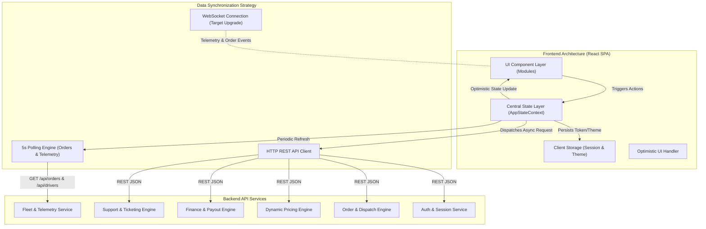
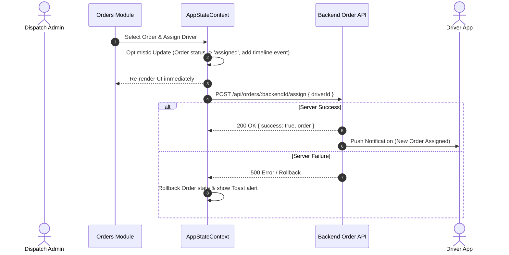
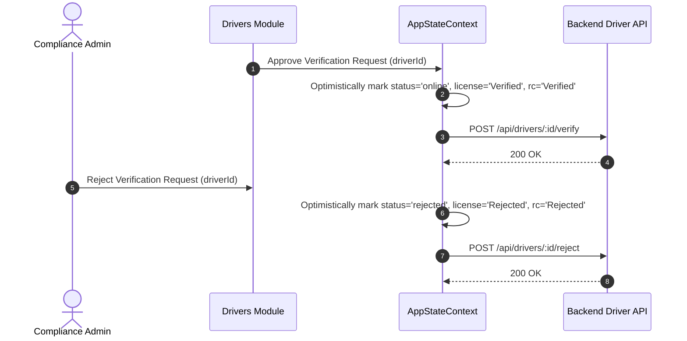
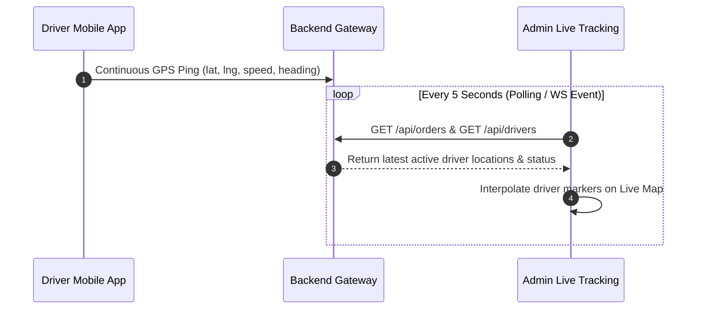

# Anusha Porter Admin - Frontend Architecture & Backend Flow Specification

This document provides a comprehensive technical overview of the **Anusha Porter Web/Admin Frontend Architecture**, state management patterns, module flows, and explicit API integration contracts required for the backend engineering team.

---

## 1. System Architecture Overview

The Anusha Porter Admin Web Application is built as a single-page application (SPA) focused on logistics management, fleet operations, driver onboarding, real-time vehicle tracking, and dynamic fare configuration.



### Key Technical Stack & Design Patterns
- **Framework**: React (SPA with Context API)
- **State Management**: `AppStateContext` (Centralized application state with modular slices)
- **Data Synchronization**: Optimistic UI updates with background HTTP API calls and 5-second fallback polling for live operational data.
- **Routing & Navigation**: Module-based view switching with breadcrumbs and state persistence.
- **Theme Support**: Dark/Light mode controlled via CSS root tokens and `localStorage`.

---

## 2. Core Operational Data Flows

### A. Authentication & Session Lifecycle

```mermaid
sequenceDiagram
    autonumber
    actor Admin as Admin User
    participant FE as React Frontend
    participant Context as AppStateContext
    participant BE as Backend Auth API

    Admin->>FE: Enter Credentials (Email & Password)
    FE->>Context: handleLogin(email, password)
    Context->>BE: POST /api/auth/login { username, password }
    alt Successful Login
        BE-->>Context: 200 OK { success: true, user, token }
        Context->>FE: Save user in localStorage & set state
        FE-->>Admin: Navigate to Dashboard Home
    else Invalid Credentials
        BE-->>Context: 401 Unauthorized { success: false, message }
        Context-->>FE: Fallback Dev Session / Error Toast
    end

    Admin->>FE: Trigger Password Reset
    FE->>BE: POST /api/auth/forgot-password { email }
    BE-->>FE: 200 OK { success: true, message: "OTP sent" }
    Admin->>FE: Enter OTP & New Password
    FE->>BE: POST /api/auth/reset-password { email, otp, newPassword }
    BE-->>FE: 200 OK { success: true }
```



---

### B. Order Dispatch & Driver Assignment Flow



---

### C. Driver KYC Verification Workflow



---

### D. Real-Time Telemetry & Tracking Flow



---

## 3. Backend API Integration Specification

Below is the exhaustive list of REST API endpoints required by the Frontend, grouped by operational module:

### Module 1: Authentication & Access Control

| Method | Endpoint | Description | Request Body Payload | Response Format |
|---|---|---|---|---|
| `POST` | `/api/auth/login` | Admin authentication | `{ username, password }` | `{ success: true, user: { id, name, email, role, avatar } }` |
| `POST` | `/api/auth/signup` | Register new admin user | `{ name, email, password, role }` | `{ success: true, user }` |
| `POST` | `/api/auth/verify-otp` | Verify OTP code | `{ email, otp }` | `{ success: true, message }` |
| `POST` | `/api/auth/forgot-password` | Request password reset OTP | `{ email }` | `{ success: true, message }` |
| `POST` | `/api/auth/reset-password` | Reset password using OTP | `{ email, otp, newPassword }` | `{ success: true, message }` |
| `POST` | `/api/auth/logout` | End session | `{}` | `{ success: true }` |

---

### Module 2: Dispatch & Order Management

| Method | Endpoint | Description | Request Payload / Query | Response Format |
|---|---|---|---|---|
| `GET` | `/api/orders` | Fetch all orders | None | `Array<OrderObject>` |
| `POST` | `/api/orders/:id/assign` | Assign driver to order | `{ driverId: string }` | `{ success: true, order }` |
| `PUT` | `/api/orders/:id/status` | Update order status | `{ status: "pending" | "assigned" | "in_transit" | "completed" | "cancelled" }` | `{ success: true, order }` |

---

### Module 3: Driver & KYC Management

| Method | Endpoint | Description | Request Payload / Query | Response Format |
|---|---|---|---|---|
| `GET` | `/api/drivers` | Fetch driver roster & status | None | `Array<DriverObject>` |
| `POST` | `/api/drivers/:id/verify` | Approve driver KYC & documents | None | `{ success: true, driver }` |
| `POST` | `/api/drivers/:id/reject` | Reject driver KYC | None | `{ success: true, driver }` |

---

### Module 4: Dynamic Pricing & Vehicle Config

| Method | Endpoint | Description | Request Payload / Query | Response Format |
|---|---|---|---|---|
| `GET` | `/api/admin/pricing/vehicles` | Fetch pricing matrix for all vehicle types | None | `Array<VehiclePricingObject>` |
| `GET` | `/pricing/vehicle/:vehicleId` | Fetch pricing config for specific vehicle | None | `VehiclePricingObject` |
| `POST` | `/pricing` | Add new vehicle pricing configuration | `VehiclePricingObject` | `{ success: true, vehicle: VehiclePricingObject }` |
| `PUT` | `/pricing/vehicle/:vehicleId` | Update pricing configuration | `VehiclePricingObject` | `{ success: true, vehicle: VehiclePricingObject }` |
| `DELETE` | `/pricing/:id` | Remove pricing tier | None | `{ success: true }` |

---

### Module 5: Finance & Payout Settlement

| Method | Endpoint | Description | Request Payload / Query | Response Format |
|---|---|---|---|---|
| `GET` | `/api/payouts` | Fetch driver payout records | None | `Array<PayoutObject>` |
| `POST` | `/api/payouts/:id/release` | Trigger bank transfer payout release | None | `{ success: true, status: "settled" }` |
| `POST` | `/api/customers/:id/topup` | Credit user wallet funds | `{ amount: number }` | `{ success: true, wallet: number }` |

---

### Module 6: Support Ticketing & Chat

| Method | Endpoint | Description | Request Payload / Query | Response Format |
|---|---|---|---|---|
| `GET` | `/api/tickets` | Fetch customer & driver support tickets | None | `Array<TicketObject>` |
| `POST` | `/api/tickets/:id/message` | Send message to customer or driver channel | `{ channel: "customer" | "driver", text: string }` | `{ success: true, message }` |
| `POST` | `/api/tickets/:id/status` | Update ticket status | `{ status: "open" | "in_progress" | "resolved" }` | `{ success: true }` |
| `POST` | `/api/tickets/:id/resolve` | Mark ticket as resolved | None | `{ success: true }` |

---

### Module 7: Broadcast Notifications

| Method | Endpoint | Description | Request Payload / Query | Response Format |
|---|---|---|---|---|
| `GET` | `/api/notifications` | Fetch notification history | None | `Array<NotificationObject>` |
| `POST` | `/api/notifications/broadcast` | Send FCM push broadcast | `{ title, message, audience, target }` | `{ success: true, notification }` |
| `POST` | `/api/notifications/:id/read` | Mark single notification read | None | `{ success: true }` |
| `POST` | `/api/notifications/read-all` | Mark all notifications read | None | `{ success: true }` |

---

### Module 8: Master Settings & User Management

| Method | Endpoint | Description | Request Payload / Query | Response Format |
|---|---|---|---|---|
| `GET` | `/api/customers` | Fetch customer directory | None | `Array<CustomerObject>` |
| `GET` | `/api/vehicles` | Fetch general vehicle list | None | `Array<VehicleObject>` |
| `GET` | `/api/franchises` | Fetch franchise locations | None | `Array<FranchiseObject>` |
| `GET` | `/api/settings` | Fetch global system settings | None | `SettingsObject` |
| `POST` | `/api/settings` | Save global system settings | `SettingsObject` | `{ success: true }` |
| `GET` | `/api/users` | Fetch admin users list | None | `Array<AdminUserObject>` |
| `POST` | `/api/users` | Save admin users list | `Array<AdminUserObject>` | `{ success: true }` |

---

## 4. Key Data Models (JSON Contracts)

### Order Schema (`OrderObject`)
```json
{
  "id": "ORD-9821",
  "backendId": 1042,
  "bookingId": "ORD-9821",
  "customer": "Rahul Sharma",
  "userEmail": "rahul.s@example.com",
  "pickup": "Koramangala 5th Block, Bengaluru",
  "drop": "Indiranagar 100ft Road, Bengaluru",
  "amount": 350.00,
  "status": "assigned",
  "driver": "Suresh Kumar",
  "driverEmail": "suresh.k@example.com",
  "createdAt": "2026-07-29T10:30:00Z",
  "timeline": [
    { "time": "10:30 AM", "text": "Order Placed" },
    { "time": "10:32 AM", "text": "Driver Assigned (Suresh Kumar)" }
  ]
}
```

### Driver Schema (`DriverObject`)
```json
{
  "id": "DRV-102",
  "name": "Suresh Kumar",
  "email": "suresh.k@example.com",
  "phone": "+91 9876543210",
  "vehicleNumber": "KA-01-EQ-4589",
  "status": "online",
  "kyc": "verified",
  "rating": 4.8,
  "licenseUri": "https://storage.anushaporter.com/kyc/lic_102.pdf",
  "rcUri": "https://storage.anushaporter.com/kyc/rc_102.pdf"
}
```

### Vehicle Pricing Schema (`VehiclePricingObject`)
```json
{
  "id": "v-tata-ace",
  "vehicleId": "tata-ace",
  "name": "Tata Ace",
  "baseFare": 210,
  "freeDistance": 3,
  "pricePerKm": 18,
  "minFare": 210,
  "maxFare": 3000,
  "capacityKg": 750,
  "maxDistance": 500,
  "status": true,
  "priority": 3
}
```

---

## 5. Backend Handoff Checklist & Recommendations

1. **Authentication Standard**: Use Standard HTTP Authorization Header: `Authorization: Bearer <JWT_TOKEN>`.
2. **CORS Headers**: Allow frontend domain origin (`http://localhost:5173` for dev, `https://admin.anushaporter.com` for production) with credentials enabled.
3. **WebSockets Migration Target**: Replace the frontend's 5-second polling loop (`setInterval`) with a Socket.io / WebSocket server emitting `order:update` and `driver:telemetry` events for real-time live map performance.
4. **Standard Error Payload Format**: When an API request fails, return standard error structures:
   ```json
   {
     "success": false,
     "error": "UNAUTHORIZED_ACCESS",
     "message": "Session expired, please re-authenticate."
   }
   ```
